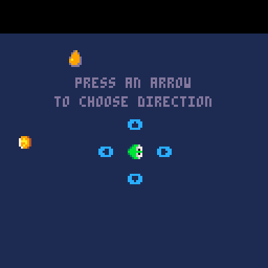
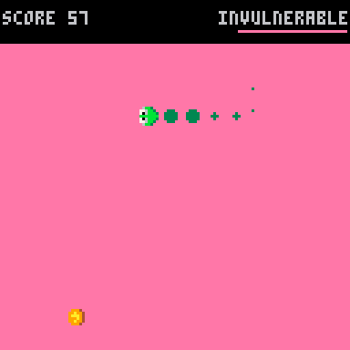
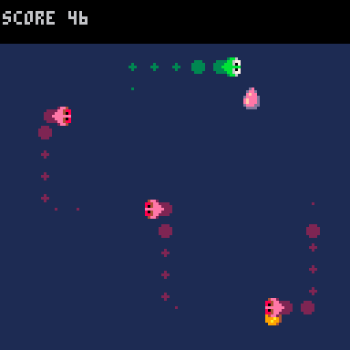

# Avoid Your Past (BeetPx)

> a snake-like [BeetPx](https://github.com/beetrootpaul/beetpx) game where each collected coin brings a harmful memory of your past steps

The original version was created by [Beetroot Paul](https://beetrootpaul.com) in PICO-8 and submitted for the [Mini Jam 111: Colors²](https://itch.io/jam/mini-jam-111-colors)

---

Your goal is to maximise your score. May it be by collecting coins (10 points for each) or activating paints (3 points for a orange one, 1 point for a pink one).

Your enemy is your past self – every time you pick a coin, a memory of your movement appears. You have to avoid those memories to stay alive.

Orange and pink paint drops result with a temporary effect. Orange paint makes coins disappear, so you cannot pick them. The pink one makes your past selves disappear, making you invulnerable.

Controls:
- arrows – change player's movement direction

---

This game is available to play on https://beetrootpaul.itch.io/avoid-your-past-beetpx .

---

